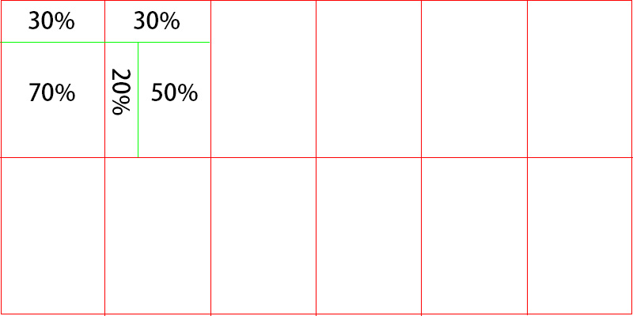
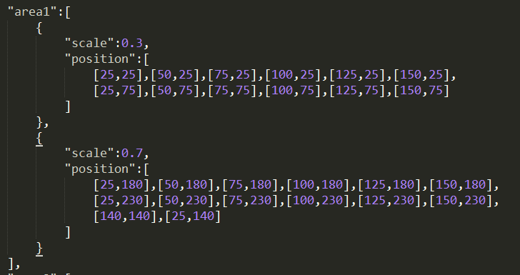
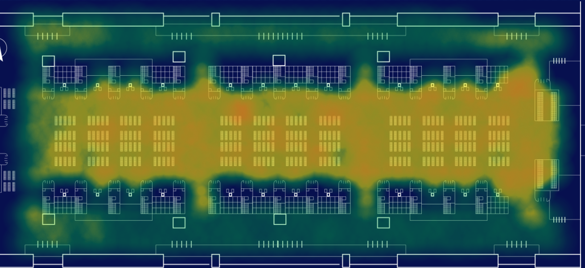

# 热力图heatmap.js使用中的思路解析

#### [heatmap.js官网地址](https://www.patrick-wied.at/static/heatmapjs/) 

## 1、需求
&emsp;&emsp;使用heatmap.js制作热力图，反映人群分布情况。

## 2、问题
&emsp;&emsp;热力图需要的数据：坐标 + 人数 + max人数， 从后台能拿到的数据总共只有12条，要怎么更加准确、效果更加地显示整个区域的人群分布呢？

## 3、壹解
&emsp;&emsp;用12条数据，12个坐标的话，每个点的半径就是超级超级大，人流分布无法详尽，效果很明显无法满足需求。×

## 4、贰解
&emsp;&emsp;整个区域分成12部分，每部分都有一个各自的总人数。而每部分根据实际人数占比划分为2-3小部分，如下图所示：

&emsp;&emsp;根据画图的点的数量：

&emsp;&emsp;第一区域area1 上下比例为3:7，top上部点数量为 6 的话，bottom下部点的数量就为 6/3*7 = 14，上下部分点的半径一致，并均匀分布，然后根据area1内的点总数，计算每个点的value，以此类推。最后根据整区域的平均值（后台数据）除以 12个区域点的平均数 得到 max值，从而成功画出热力图。（因是后面整理的笔记，故无效果图）

&emsp;&emsp;后经过测试，与实际情况并不相符，差别甚大。×

## 5、叁解 
&emsp;&emsp;改变方式，根据画图的点的值：

&emsp;&emsp;在第一区域area1内，均匀分布点的坐标（通过后面自我测试，发现横向两点间距最佳为半径的一半，纵向间距为半径距离），例如半径为50，area1点坐标为：（因背景底图上会有建筑物部分，热力图不能覆盖，故无法使用代码计算坐标）

　　　　　

　　area1总人数为m，area1上部分人数：m * 30%，下部分人数：m * 70% 。每个点的value为，上部分： m * 30%，下部分： m * 70% ， max：area1的平均值（后台数据）  ， 成功达到预期效果，与实际情况也是90%吻合

最终效果图：

　　